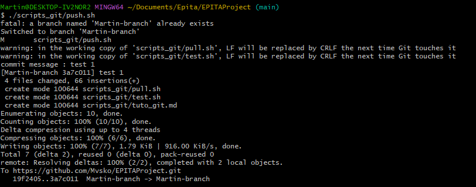
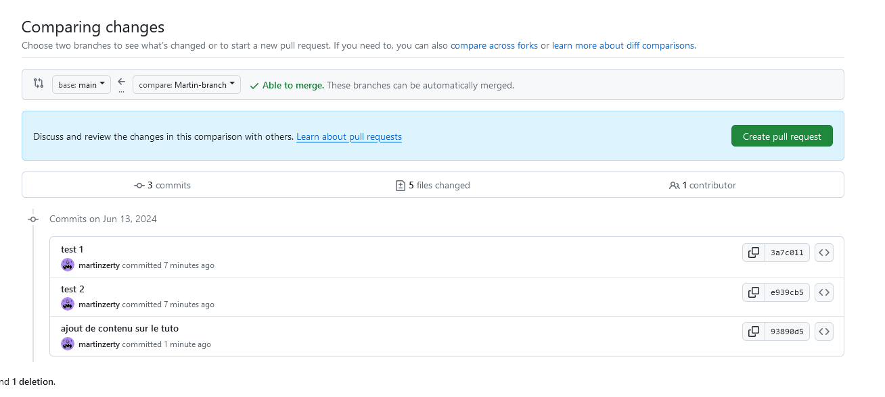
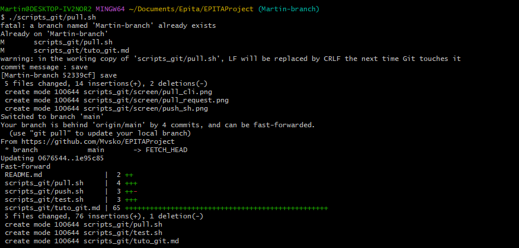

# Petit tuto pour utiliser git en tout sérénité

Pour que personne ne se batte que tout fonctionne bien, on va suivre quelques petits principes.

* [Utilisation du git](#utilisation-du-git)
* [Utilisation des scripts](#utilisation-des-scripts)
* [Erreurs possibles](#les-erreurs-possible)
    1. [Permission denied](#permission-denied)
    2. [Erreur branche](#a-branch-named-name-already-exists)

## Utilisation du git

1. L'utilisation du fichier `scripts_git/push.sh` est la plus simple. Le fichier est fait pour tout gérer, les branches, les ajout, les commits et les push.
1. Quand on ajoute des éléments sur le repo en local (`git add`), il faut s'assurer de **ne pas être sur la branche `main`** !! Le mieux, pour sauvegarder le code c'est d'utiliser directement le fichier `scripts_git/push.sh`. C'est tout à fait sûr et on l'explique juste après.
2. Quand on veut commit :
    * Soit on le fait à la mano (`git commit -am "super mise à jour !`)
    * Soit on utilise le ficher `scripts_git/push.sh` pour push directement. Ce fichier crée une nouvelle branche et ajoute le contenue sur cette dernière. A la suite du renseignerment d'un message de commit la push. Donc le code que vous venez de mettre à jour ne se met pas directement sur le main, pas de soucis de conflit.
    
3. La mise sur le main, sur github.
    * Quand on a push sur notre branche, ça s'affiche sur github uniquement dans la branche qu'on a créé. Pour mettre tout ça sur le main, il faut créer des pull request. Il faut les vérifier, s'assurer que ça rentre pas conflit avec des truc importants.
    
    * Une fois que la pull request est crée, on annonce à chacun de se mettre à jour, soit avec le fichier `scripts/pull.sh`, soit avec `git checkout main && git pull origin main` mais en ayant pensé à commit avand sur sa propre branche. Il faut bien penser à se mettre sur la branche main avec le pull !!
    
4. Une fois que le code est pull sur la branche main, il faudra aussi la mettre sur votre propre branch et c'est là qu'intervient le script `scripts_git/merge.sh`. Il sauvegarde votre progression sur votre branche, puis fusionne la branche main dessus. **Attention !** Il peut y avoir des confits. Ceci peuvent être rêglés sur la cli ([tuto](https://docs.github.com/fr/pull-requests/collaborating-with-pull-requests/addressing-merge-conflicts/resolving-a-merge-conflict-using-the-command-line)) ou sur vscode directement ([tuto](https://code.visualstudio.com/docs/sourcecontrol/overview)).
5. La zone de danger c'est `scripts_git/reset.sh` qui recupère tout le code de la branche main sur github et écrase le contenu actuel.

## Utilisation des scripts

Les scripts sont des fichiers `bash`. Ils s'executent directement depuis votre interface de commande (cmd, PowerShell, GitBash, Terminal, Iterm...). Sur Windows, je recommande [GitBash](https://www.git-scm.com/download/win). Pour executer un fichier bash, il suffit de faire `./[chemin du ficher]`. Par exemple, essayez d'executer le fichier `test.sh` avec :
```bash
./test.sh
```
Fonctionne aussi :
```bash
./scripts_git/test.sh
```

Vous devriez avoir :
```bash
$ ./scripts_git/test.sh
executed.
```

**Attention !** Pour les executer, vous devez avoir le droit de les executer. Vous pourriez avoir une erreur qui vous indique que vous n'avez pas le droit d'executer le fichier. Alors, accordez vous les droits d'execution avec :
```bash
chmod +x [fichier]
```

Et ça devrait fonctionner normalement.

## Les erreurs possible

### Permission denied
Lors de l'execution d'un script, il est possible d'avoir cette erreur :
```bash
$ ./foo.sh
bash: ./foo.sh: Permission denied
```
Alors, accordez vous les droits (sans `sudo`):
```bash
chmod +x foo.sh
```

### A branch named [name] already exists
Il est très fortement probable que vous ayez une erreur comme celle ci quand vous executez `scripts_git/push.sh` :
```bash
$ ./scripts_git/push.sh
fatal: a branch named 'Martin-branch' already exists
```
**C'est pas grâce, ça change rien.** Le script essaye de créer une branche qui existe déjà, mais c'est pas grâve vuq eu le but c'est de switch desssus.

https://www.youtube.com/watch?v=ygqx50-JHEE